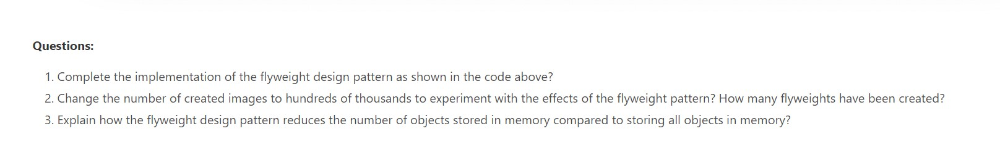

# CPIT252-Lab7-submission
This is the submission file for lab 7 activity for CPIT252.

A2: only 4 flyweights

A3: it stores each new object created in the memory in some kind of data structure such as maps, and it acts as a cache. Whenever the program wants a new object, it first checks if the same object is created before, if it does, it passes the same old object isntead of creating a new one, and if it doesn't it creates the new object and stores it for future use.
